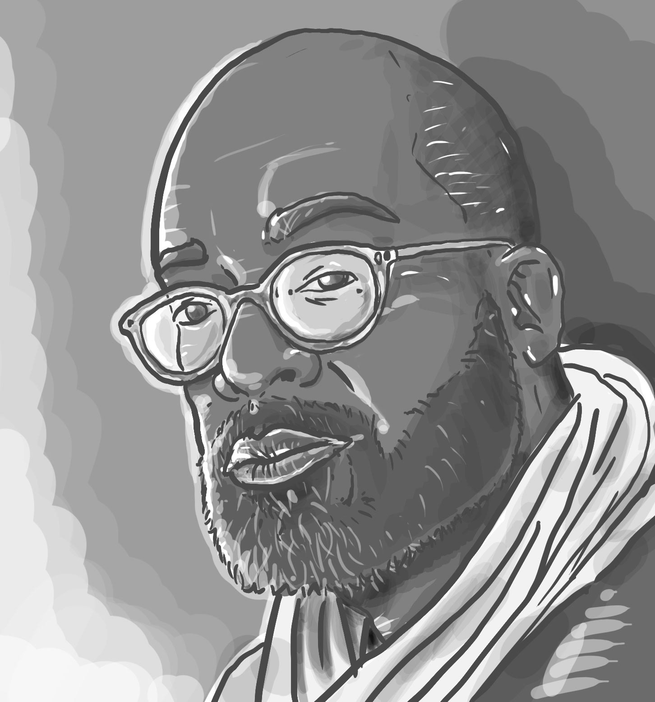
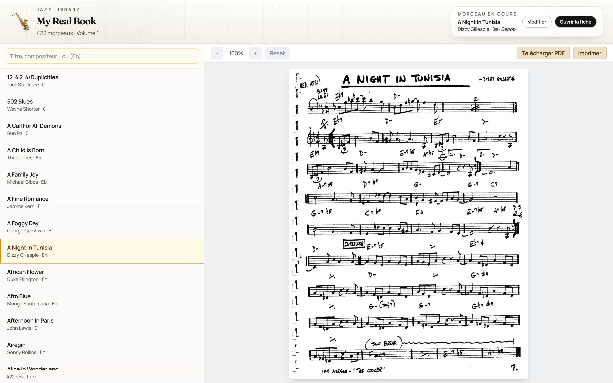
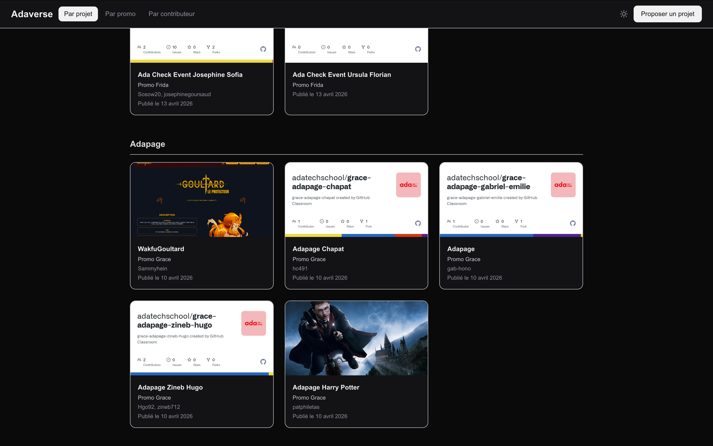
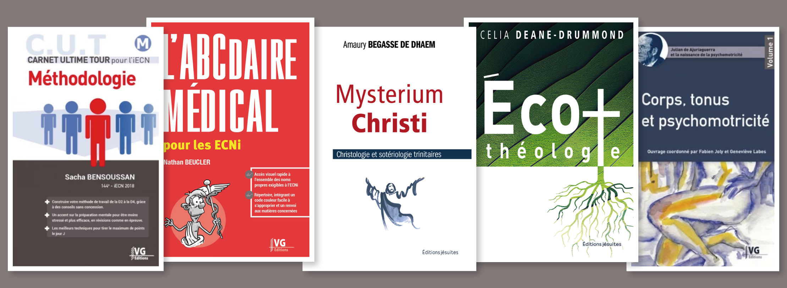

<div align="center">



# Portfolio Patrice Philétas

**Portfolio développeur full stack et graphiste éditorial.**

[](https://github.com/patphiletas/Portfolio)
&nbsp;
[](https://nextjs.org/)
&nbsp;
[](https://react.dev/)
&nbsp;
[](https://www.typescriptlang.org/)
&nbsp;
[](https://tailwindcss.com/)

</div>

---

## Aperçu

<div align="center">
  
  
  
</div>

<br/>

Ce portfolio présente mon parcours de reconversion vers le développement web full stack après près de 20 ans dans le graphisme éditorial. Il rassemble mes projets web, mes compétences techniques, mon expérience en direction artistique et les liens de contact pour une recherche d'alternance à partir de septembre 2026.

---

## Fonctionnalités

| Fonctionnalité | Description |
|---|---|
| Projets web | Cartes détaillées avec description, stack, démo, GitHub et README |
| Graphisme | Sélection de travaux éditoriaux, illustration et communication print |
| Parcours | Présentation de la reconversion, de la formation Ada Tech School et de l'expérience professionnelle |
| Compétences | Vue synthétique des compétences front-end, back-end, outils et graphisme |
| Contact | Liens directs vers email, téléphone, GitHub, LinkedIn, CV et portfolio PDF |
| Thème clair/sombre | Gestion du thème via contexte React et variables CSS |
| Responsive | Interface adaptée aux écrans mobiles, tablettes et desktop |

---

## Stack technique

| Couche | Technologie |
|---|---|
| Framework | Next.js 16 avec App Router |
| Interface | React 19, TypeScript |
| Styles | Tailwind CSS 4, CSS variables |
| Animations | Framer Motion |
| Qualité | ESLint, configuration Next.js |
| Déploiement | Vercel |

---

## Structure du projet

```txt
portfolio-patphiletas/
├── app/
│   ├── components/      # Cover (sommaire), Chapter, About, Projects, Graphisme, Contact, Navbar
│   ├── context/         # ThemeContext
│   ├── globals.css      # Thèmes, variables CSS et styles globaux
│   ├── layout.tsx       # Layout racine
│   └── page.tsx         # Composition des sections
├── lib/
│   └── data.ts          # Projets, items graphisme, compétences et clients
├── public/
│   ├── images/          # Captures projets, portrait et visuels graphisme
│   ├── cv-patrice-philetas.pdf
│   └── portfolio-graphisme.pdf
└── package.json
```

---

## Installation

```bash
npm install
```

---

## Lancement

```bash
npm run dev
```

Le site est ensuite disponible sur :

```txt
http://localhost:3000
```

---

## Scripts disponibles

| Script | Description |
|---|---|
| `npm run dev` | Lance le serveur de développement Next.js |
| `npm run build` | Génère la version de production |
| `npm run start` | Lance l'application après build |
| `npm run lint` | Exécute ESLint |

---

## Contenus principaux

| Section | Source |
|---|---|
| Projets web | `lib/data.ts` |
| Travaux graphisme | `lib/data.ts` et `public/images/` |
| CV | `public/cv-patrice-philetas.pdf` |
| Portfolio graphisme | `public/portfolio-graphisme.pdf` |
| Thème | `app/context/ThemeContext.tsx` et `app/globals.css` |

---

## Prochaines évolutions

- [x] Présentation des projets web avec liens README, démo et GitHub
- [x] Section graphisme avec références éditoriales
- [x] Mode clair/sombre
- [ ] Ajouter une capture globale du portfolio dans le README
- [ ] Ajouter des tests d'accessibilité et de rendu responsive
- [ ] Enrichir chaque projet avec une page détail dédiée

---

<div align="center">

Développé comme portfolio de reconversion full stack · Patrice Philétas 2026

</div>
